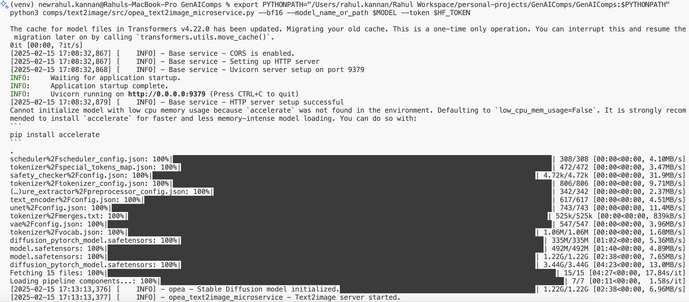
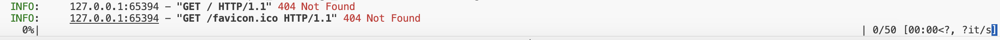

# Task 1  

## Description 

Choose one particular OPEA component & try analysing the code to explore deep
This will give you a basic sketch on how OPEA comps are structured & document it

## Working Notes

I chose **Text-to-Image Microservice** to analyze and run it seperately.

[Opea-project documentation link for text to image microservice](https://opea-project.github.io/latest/GenAIComps/comps/text2image/src/README.html#start-microservice-with-python-option-1)

Started Analysing the code - https://github.com/opea-project/GenAIComps/tree/main/comps/text2image/src

### Observations

Analysing [Component main file](https://github.com/opea-project/GenAIComps/blob/main/comps/text2image/src/integrations/native.py)
1. All the Components are derived from the abstract base class "OpeaComponents" - it has basic initialization constructor, updating meta data, setting meta data, and a abstract method "Invoke" (which all the base class should implement)
2. Service Registry is maintained in the class "OpeaComponentRegistry", all the services should be registered here using the implemented register / unregister method
3. Seperate Loader class to load class dynamically and invoke - "OpeaComponentLoader"
4. **Invoke method implemented in the class of text2image component, internally uses HuggingFace library's DiffUsers for calling the respective models** - https://huggingface.co/docs/diffusers/main/en/index
5. Hardware optimized pipelines are available in the Diffusers library, which is extended in the Component
6. Registering of the component is done in this main file

Now, after analysing the implementation of the component (above), going to analyze the [Microservice](https://github.com/opea-project/GenAIComps/blob/main/comps/text2image/src/opea_text2image_microservice.py)

1. Now, we have the component registered already in the componentRegistry, in this file, we have to register the Microservice ( needed for service discovery & communication for mega service), as of now, we are going to concentrate morely on the seperate microservice alone
2. Parsing arguments was the initial step, going with all defaults
3. Component is loaded using the loader class we discussed earlier [pt. 3 in above section]
4. asynchronous implementation of method "text2image" is defined, which uses the loader above and invokes the internal library (which is diffusers library from HuggingFace)
5. microservice is started

We can start using the text2Image comp using 2 methods, 1 is using python , 2 with Docker, will try with python first. 

Using Python

 😫 Faced hell lot of time in resolving the dependencies, and making it run
 documentation is not helping much

Steps 

- refer https://github.com/opea-project/GenAIComps/blob/main/comps/text2image/src/README.md first, then continue the steps below

- clone the repo and run 
```
git clone https://github.com/opea-project/GenAIComps
cd GenAIComps
pip install -e .
```

💡 Hint - using python virtual environment is making life easier here

- set the environment variable for Model and Hf token 
```
export PYTHONPATH="/Users/rahul.kannan/Rahul Workspace/personal-projects/GenAIComps/GenAIComps:$PYTHONPATH"
python3 comps/text2image/src/opea_text2image_microservice.py --bf16 --model_name_or_path $MODEL --token $HF_TOKEN
```

- there are some dependecies not properly listout in requirements.txt file, so needs manual intervention, during my runs, I had to manually install torch, diffusers, transforms python library

- I chose the base diffuser model, and it took around 4-5 minutes to download all the dep, and start running



Finally, going to test 😎

I tried the same example provided in the documentation

```
curl http://localhost:9379/v1/text2image -XPOST -d '{"prompt":"An astronaut riding a green horse", "num_images_per_prompt":1}' -H 'Content-Type: application/json'

```

unfortunately, system cpu got spiked, and waited for so long with the below screen



percentage wasn't improving

there was a suggestion to use 

```
pip install accelerate
```

will try that

no luck 👎 Failed to produce result in local

CPU spiked, and not using available GPU
